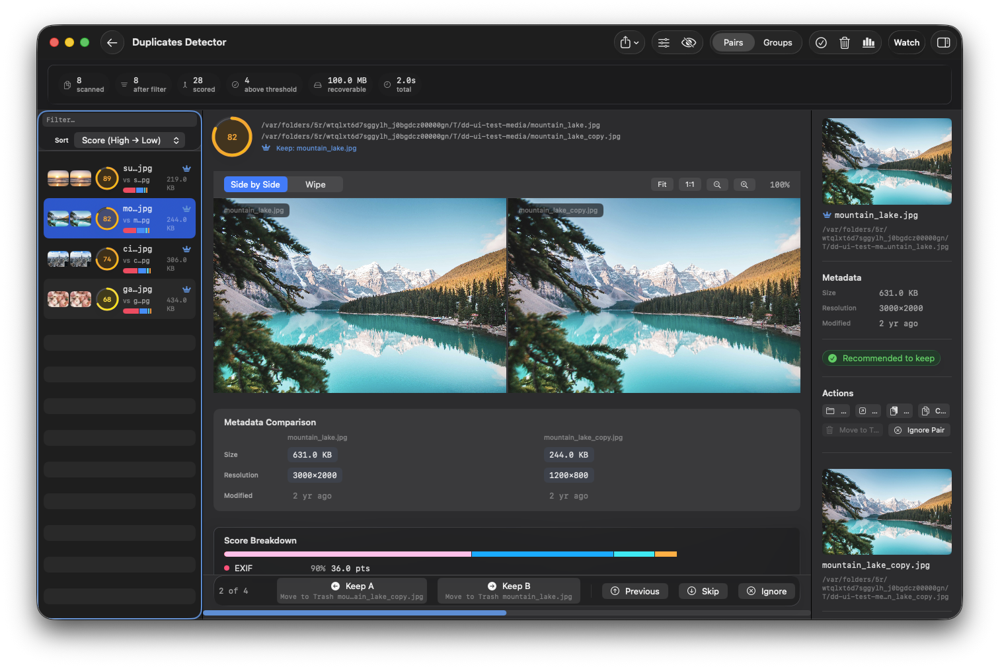
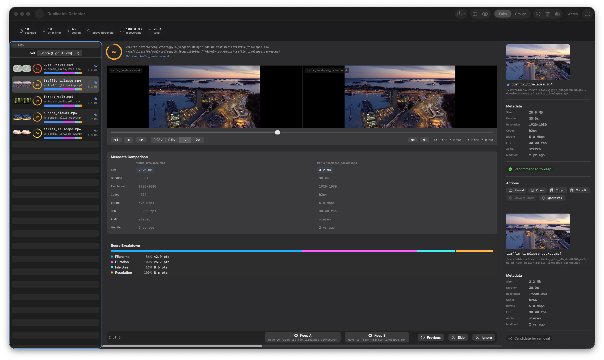
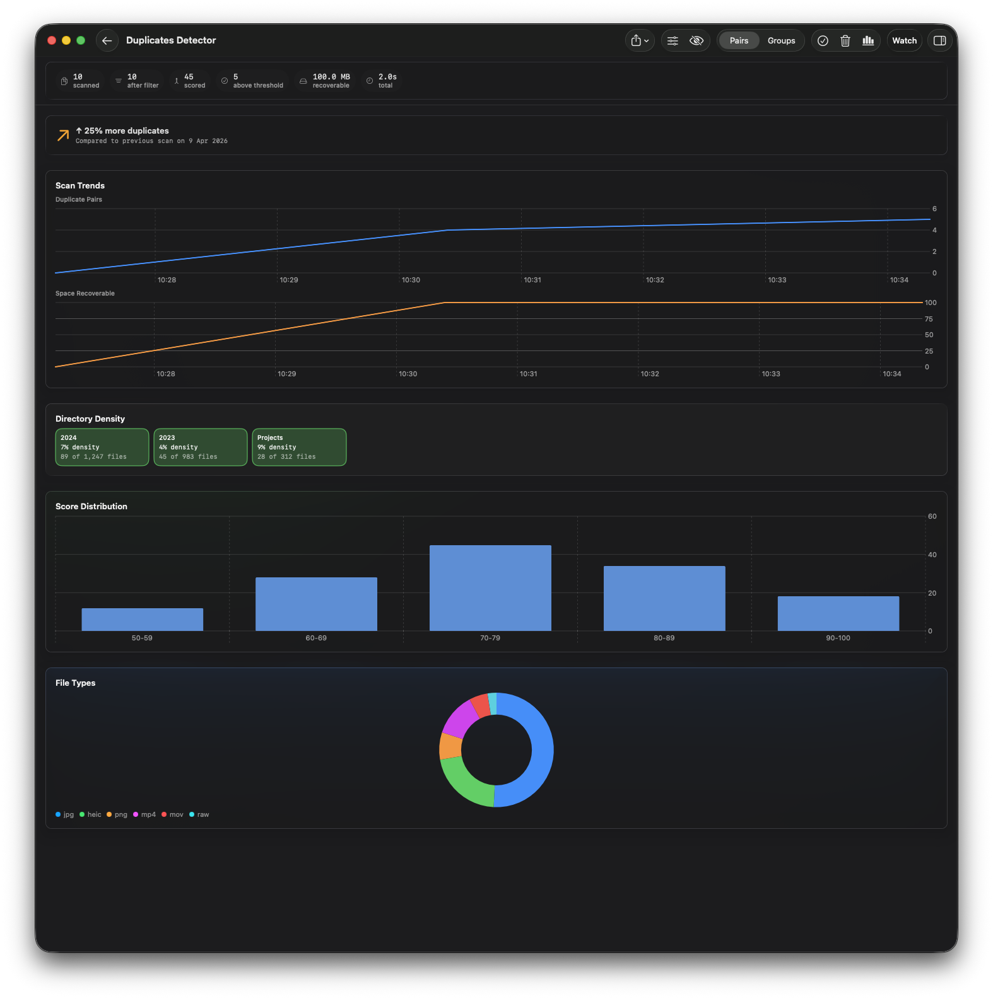
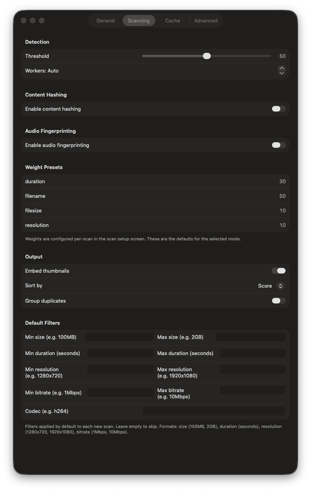

# Duplicates Detector

> Find and clean up duplicate photos, videos, and audio files — with side-by-side comparison so you always keep the right one.




Duplicates Detector scans your media library, scores every pair of similar files from 0 to 100, and lets you compare them side by side before deciding what to keep. Works with photos, videos, audio, and documents.

---

## Compare Videos Side by Side



Play two videos in sync with matched timelines. See resolution, codec, and bitrate differences at a glance, with a per-comparator score breakdown. One click to keep the better copy and trash the other.

## Understand Your Library



See where duplicates concentrate with a directory heatmap, track scan trends over time, and break down results by file type and score distribution. Know exactly how much storage you can reclaim before taking action.

## Fine-Tune Everything



Adjust scoring weights per comparator, set detection thresholds, configure content-based methods, and save named TOML profiles for different workflows. Output as rich tables, JSON, CSV, shell scripts, or self-contained HTML reports.

---

## Features

- **Multi-format** — video, image, audio, and document deduplication
- **Content-based detection** — PDQ perceptual hashing, SSIM, CLIP embeddings, Chromaprint audio fingerprinting
- **Safe actions** — trash (reversible), move, hardlink, symlink, reflink, with undo script generation
- **Interactive review** — step through pairs, keep A/B/skip, with a persistent ignore list for false positives
- **Transitive grouping** — clusters related duplicates so you see the full picture
- **Pause and resume** — interrupt a scan and pick up where you left off
- **Watch mode** — monitor directories for new duplicates in real time
- **Multiple output formats** — JSON, CSV, HTML, shell script, Markdown, rich terminal tables
- **Configurable profiles** — TOML config with named profiles and custom weight tuning

### macOS App

- Side-by-side media comparison (synced video playback, image zoom/wipe)
- Visual score breakdown with per-comparator detail
- One-click keep/trash/move actions
- Photos Library scanning via PhotoKit (no export needed)
- Scan history, profiles, and Shortcuts/Siri integration
- Background watch mode with notifications

## Install

### macOS (Homebrew)

```bash
brew tap omrikais/duplicates-detector
brew install --cask duplicates-detector
```

Installs the macOS app and the `duplicates-detector` CLI. ffmpeg and Chromaprint are bundled — no extra dependencies needed.

### CLI Only (pip)

Requires Python 3.10+ and ffmpeg.

```bash
pip install duplicates-detector
```

Optional extras:

```bash
pip install "duplicates-detector[trash]"    # trash action (send2trash)
pip install "duplicates-detector[audio]"    # audio mode (mutagen)
pip install "duplicates-detector[ssim]"     # SSIM content method (scikit-image)
```

System dependencies:

```bash
# macOS
brew install ffmpeg chromaprint

# Ubuntu/Debian
sudo apt install ffmpeg libchromaprint-tools
```

## Quick Start

```bash
# Scan for duplicate videos
duplicates-detector scan /path/to/videos

# Image deduplication with EXIF scoring
duplicates-detector scan /path/to/photos --mode image

# Audio deduplication with tag matching
duplicates-detector scan /path/to/music --mode audio

# Content-based detection (catches re-encodes and renamed copies)
duplicates-detector scan /path/to/videos --content

# Interactive review — step through each pair
duplicates-detector scan /path/to/videos -i

# Self-contained HTML report with analytics
duplicates-detector scan /path/to/videos --format html -o report.html

# JSON output with metadata envelope
duplicates-detector scan /path/to/videos --format json --json-envelope
```

## How Scoring Works

Each pair of files is scored 0-100 by combining weighted comparators:

| Comparator | Video | Image | Audio |
|---|---|---|---|
| Filename | 50 | 25 | 30 |
| Duration | 30 | — | 30 |
| Resolution | 10 | 20 | — |
| File size | 10 | 15 | — |
| EXIF | — | 40 | — |
| Tags | — | — | 40 |

Content-based comparators (`--content`, `--audio`) add a separate scoring dimension that can override metadata-only scores when files are perceptually similar.

Weights are fully customizable via `--weights` or config profiles.

## Configuration

Create `~/.config/duplicates-detector/config.toml`:

```toml
[defaults]
verbose = true
content = true
min_score = 70

[profiles.photos]
mode = "image"
content = true
rotation_invariant = true

[profiles.music]
mode = "audio"
audio = true
min_score = 60
```

```bash
duplicates-detector scan /path/to/photos --profile photos
```

### Keep Strategies

| Strategy | Keeps |
|---|---|
| `longest` | Longer duration |
| `shortest` | Shorter duration |
| `largest` | Larger file size |
| `smallest` | Smaller file size |
| `newest` | Most recently modified |
| `oldest` | Oldest modification time |
| `edited` | Most sidecar edits (.xmp, .aae, etc.) |

### Deletion Actions

| Action | Description |
|---|---|
| `trash` | Move to system trash (reversible) |
| `move` | Move to a specified directory |
| `delete` | Permanent deletion |
| `hardlink` | Replace duplicate with hardlink to kept file |
| `symlink` | Replace duplicate with symlink to kept file |
| `reflink` | Copy-on-write clone (APFS/Btrfs) |

All actions are logged. Use `--generate-undo` to create a script that reverses deletions.

## License

MIT
